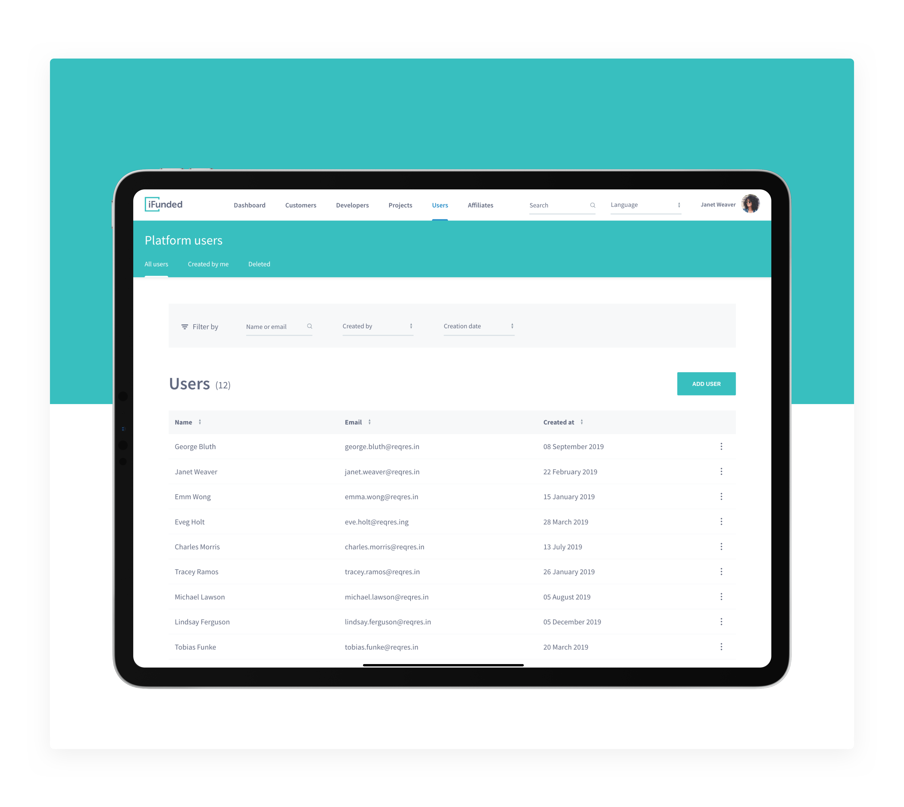

# iFunded - Code Challenge



"iFunded - Code Challenge" is a project built as part of the hiring process at the iFunded company. The project brief required that I developed a simple web app using Vue.js where the user could see a list of the users, add new users and edit their first/last name + email.

My proposal involves creating a CRM platform to aggregate and manipulate the service<>user relationship.

To achieve this result, I started with the User Experience aspects of the interface, then moved into the User Interface details and lastly into Frontend Development. To gain time, I have made use of Vue CLI to quickly scaffold the project. The modals and snackers have all been created with pure Vanilla Javascript and Vue.js state manipulation.

I deliberately made the decision of not using any styling library and wrote the SASS/CSS code by myself.

It was my intention to use Vuex to manipulate the global source of data given the fact that I am working with a REST API and keeping the data-lifecycle legible becomes much easier when data-manipulation is modularised. Vue Router was left outside given the fact that the project brief only requires one page and the state does not need to be persisted across multiple routes.

See the Live Demo for this project [here](https://iorrah.github.io/ifunded).

## Start by cloning the project

Clone with SSH

```
git clone git@github.com:iorrah/ifunded.git
```

## Install the dependencies

Setup the project

```
npm install
```

### Start the local server

Compiles and hot-reloads for development

```
npm run serve
```

### Compiles and minifies for production
```
npm run build
```

### Run your unit tests
```
npm run test:unit
```

### Run your end-to-end tests
```
npm run test:e2e
```

### Lints and fixes files
```
npm run lint
```
